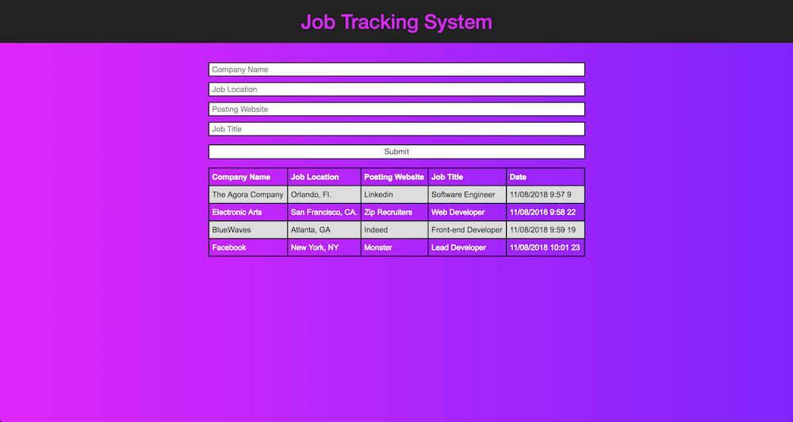

# Job Tracking System
Takes user input and dynamically creates a table and organizes it in order for the user to keep track of his/her job search.

# Test The Project
[Click Me](https://robydoidao2006.github.io/jobTrackingSystem/)

V.5.0 ~ Date: 11/10/2018.

#### Major technical improvements
- Fix property value of null on date output - it display the time correctly but error persisted on the dev tools.
- Newest post now displays on the top of the table
- Previous and newer user post will be store via localstorage and display.

V.4.0 ~ Date: 11/09/2018.
#### Minor visual improvements.
- Seconds was removed from the date as its irrelevant to the project.

#### Major technical improvements.
- User input is now being store on the localStorage.

V.3.0 ~ Date: 11/08/2018.
#### Major visual improvements.
- Fixed divs proportion
- 100% responsive
- Added even lines for easy readability

#### Minor technical improvements.
- Code clean up.
- Concatinating.
- Fix bug, Where current time was not being update to current time submition.

V.2.0 ~ Date: 11/07/2018.
- Current time added to the output.

V.1.0 ~ Date: 11/06/2018.
- Grabs user input, and display company name, job location, posting website and job title.

 
