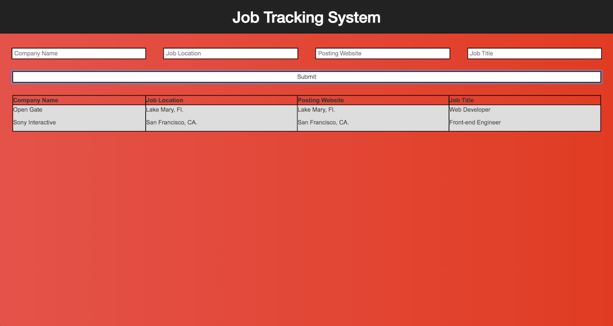

# job tracking System
takes user input and organizes it in order for the user to keep track of his/her job search.

https://robydoidao2006.github.io/jobsearch/

V.4.0 ~ Date: 11/09/2018.
#### Minor visual improvements.
- Seconds was removed from the date as its irrelevant to the project.

#### Major technical inprovement.
- User input is now being store on the localStorage.

V.3.0 ~ Date: 11/08/2018.
#### Major visual improvements.
- Fixed divs proportion
- 100% responsive
#### Minor technical improvements.
- Code clean up.
- Concatinating.
- Fix bug, Where current time was not being update to current time submition.

V.2.0 ~ Date: 11/07/2018.
- Current time added to the output.

V.1.0 ~ Date: 11/06/2018.
- Grabs user input, and display company name, job location, posting website and job title.

 
